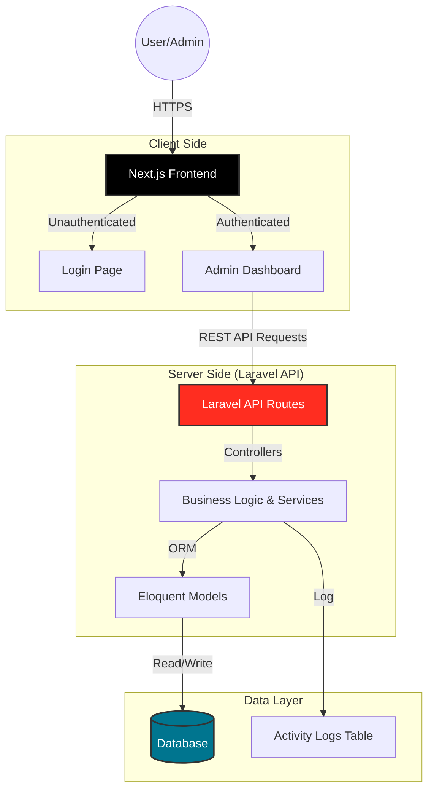

# DashX - Student Management System

DashX is a modern, comprehensive Student Management System designed to streamline educational administration. It features a robust backend built with Laravel and a dynamic, responsive frontend using Next.js.

## 🏗 System Architecture



## ✨ Key Features

-   **User Management**: Secure authentication and role-based access for Admins and Lecturers.
-   **Student & Staff Records**: Complete profile management for students and academic staff.
-   **Academic Structure**: Flexible configuration of Stages, Study Types (Morning/Evening), Groups, and Courses.
-   **Course Management**: Manage subjects, codes, and semester assignments.
-   **Grading System**: Comprehensive grade recording and management.
-   **Activity Logging**: Automatic tracking of all critical system actions (Create, Update, Delete) for security and auditing.
-   **Modern UI/UX**: Dark/Light mode support, responsive design, and intuitive navigation.

## 🛠 Technology Stack

-   **Backend**: Laravel 11 (PHP 8.2+)
-   **Frontend**: Next.js 15 (React 19, TypeScript)
-   **Styling**: Tailwind CSS 4, Shadcn/ui
-   **Data Fetching**: SWR / Axios
-   **Database**: MySQL / SQLite (configurable)

## 🚀 Getting Started

### Prerequisites
-   PHP & Composer
-   Node.js & npm / yarn

### Backend Setup (Laravel)
The backend API usually runs on port `8000`.

```bash
cd backend
composer install
cp .env.example .env
php artisan key:generate
php artisan migrate --seed # Sets up DB and creates Admin user
php artisan serve
```

### Frontend Setup (Next.js)
The frontend application runs on port `3000`.

```bash
cd frontend
npm install
npm run dev
```

## 🔐 Credentials
Default Admin credentials (from seeder):
-   **Email**: `admin@dashx.com`
-   **Password**: `password`
